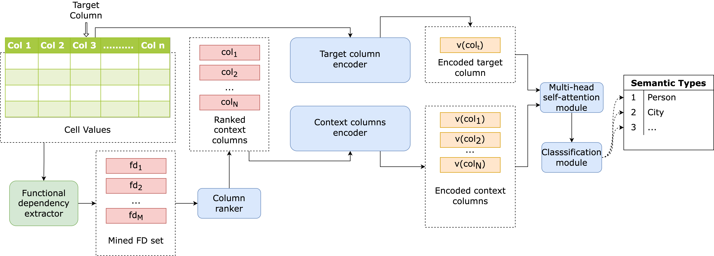

# FEDORA

This is the directory for FEDORA: **F**unctional-d**E**pen**D**ency-enhanced c**O**lumn semantic type annotation f**RA**mework.

## Requirements

We suggest using Anaconda to set up the enviroment needed for FEDORA.

Python version used is python 3.6.13. Please check the requirements.txt file in the directory to install all the required packages.

## Replicating results

To replicate the results in our paper, please kindly follow the steps below:  
1. Git clone the whole repository.
2. Set up the environment according to requirements.
3. Modify the [data](./data) directories if necessary.
4. Download the pre-trained models for the 5-fold cross validation in [pre-trained](./pre-trained) and move them to [checkpoints](./checkpoints) directory.
5. Run [FEDORA-Semtab-test.py](https://github.com/fedora2022/FEDORA-ICDM/blob/main/scripts/FEDORA-Semtab-test.py) and [FEDORA-WebTables-test.py](https://github.com/fedora2022/FEDORA-ICDM/blob/main/scripts/FEDORA-WebTables-test.py) and check the outputs.

## Train from scratch

If you want to train FEDORA from scratch, please follow the steps below:  
1. Git clone the whole repository.
2. Set up the environment according to requirements.
3. Download the raw datasets, check the links in [data](./data) directory. (optional)
4. Mask the headers using [mask-headers.py](https://github.com/fedora2022/FEDORA-ICDM/blob/main/pre-process/mask-headers.py). Check the [pre-process](./pre-process) directory. (optional)
5. Mine the FDs from the tables and stored them as a side information if you do not use our pre-processed [data](./data). Ckeck the [FD](./FD) directory for details. (optional)
6. Pre-process the datasets with [generate_jsonl.py](https://github.com/fedora2022/FEDORA-ICDM/blob/main/pre-process/generate_jsonl.py) if you do not want to use our pre-processed [data](./data). (optional)
7. Run [FEDORA-Semtab.py](https://github.com/fedora2022/FEDORA-ICDM/blob/main/scripts/FEDORA-Semtab.py) and [FEDORA-WebTables.py](https://github.com/fedora2022/FEDORA-ICDM/blob/main/scripts/FEDORA-WebTables.py) to store the training models.
8. Run [FEDORA-Semtab-test.py](https://github.com/fedora2022/FEDORA-ICDM/blob/main/scripts/FEDORA-Semtab-test.py) and [FEDORA-WebTables-test.py](https://github.com/fedora2022/FEDORA-ICDM/blob/main/scripts/FEDORA-WebTables-test.py) and check the outputs.

## Contact

Please submit a GitHub issue if you encounter any problems with FEDORA.
